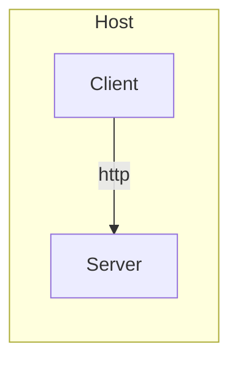
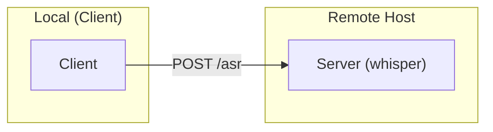

## WASTE: Whisper Audio Service for Transcription and Ergonomics

This repo shares my (opinionated) setup in Linux to reduce keyboard use by making the most of speech to text, with [whisper](https://github.com/openai/whisper).

The main goal is to get speech to text anywhere:

* press a key
* rofi pops up with language selection (recording starts immediately)
* press enter to choose language **and** stop recording
* notification pops when transcription is ready
* whisper's output text becomes available in the clipboard


## How?

There are 3 main components:

* [whisper-asr](https://github.com/ahmetoner/whisper-asr-webservice) http **server** which receives audio files and transcribes using whisper
* **client** script to send audio files to the server

The setup relies on:

* [systemd](https://systemd.io) (to run server and proxy as services)
* [pacmd](https://linux.die.net/man/1/pacmd) (to list audio sources)
* [arecord](https://linux.die.net/man/1/arecord) (to record audio)
* [whisper-asr](https://github.com/ahmetoner/whisper-asr-webservice) (to transcribe audio files)
* [rofi](https://github.com/davatorium/rofi) (for user interaction, I use it on i3 wm)
* [dunstify](https://linuxcommandlibrary.com/man/dunstify) (to send notification once transcription is ready)
* [xclip](https://linux.die.net/man/1/xclip) (to copy text to clipboard)

## Setup

The two possible setups are:

* **Single Host**: one host running the **server** and the **client**. In other words, you run whisper in the same machine where you need a transcription.
* **Remote**: one host running the **server**, and another host running the **client**. In other words, you run whisper in a remote machine, and you access it from your local machine whenever you need a transcription.

### Setup Single Host



Copy the file `.example-single-host-env` to `.env` and edit it to your needs:

```sh
AUDIO_DEVICE=alsa_input.pci-0000_03_00.6.analog-stereo # find your mic with 'pacmd list-sources`
LANGS="en,es" # comma separated list of languages to transcribe
BIN_PATH="/home/user/.local/bin" # path where the client script will be installed
PATTERNS_FILE="/home/user/.waste-patterns.sed" # path to sed patterns file
WHISPER_MODEL=medium # whisper model to use
```

* Run `make install-server` (generates and installs systemd units)
* Run `make install-client` (generates and installs client script)

Now you can bind the client script to a key in your window manager, for example in i3:

```sh
bindsym $mod+n exec $HOME/.local/bin/rofi-waste-request
```

### Setup Remote



**NOTE ON SECURITY**: This is not meant to be used in a public network, as it does not use any encryption or auth of any kind. Do not expose the server to the internet. It is meant to be used in a private network, where you trust all the hosts.

**In the remote host:**

Copy the file `.example-server-env` to `.env` and edit it to your needs:

```sh
WASTE_ENDPOINT=192.168.1.10:29999 # ip and port where server will listen
WHISPER_MODEL=medium # whisper model to use
```

* Run `make install-server` (generates and installs systemd units, including proxy)

**In the local host:**

Copy the file `.example-client-env` to `.env` and edit it to your needs:

```sh
AUDIO_DEVICE=alsa_input.pci-0000_03_00.6.analog-stereo # find your mic with 'pacmd list-sources`
LANGS="en,es" # comma separated list of languages to transcribe
BIN_PATH="/home/user/.local/bin" # path where the client script will be installed
PATTERNS_FILE="/home/user/.waste-patterns.sed" # path to sed patterns file
WASTE_ENDPOINT="192.168.1.10:29999" # remote host IP and port where server is listening
```

* Run `make install-client` (generates and installs client script)

Now you can bind the client script to a key in your window manager, for example in i3:

```sh
bindsym $mod+n exec $HOME/.local/bin/rofi-whisper-request
```

## Uninstall

Run `make uninstall`.
